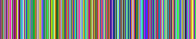

# Visualiser

Output a visualisation of various sorting algorithms as a gif. Uses [my fork of a C++ gif library](https://github.com/geekskick/gif-h) to produce the output files.

## USAGE

```
Usage:
    -o  output filename without .gif
    -s  sort type: merge bubble selection heap radix all 
    -r  Repeat the Gif
    -h  Help menu
```

## Outputs

### Merge


### Radix


And endlessly looping:


### Heap


### Bubble


### Selection
